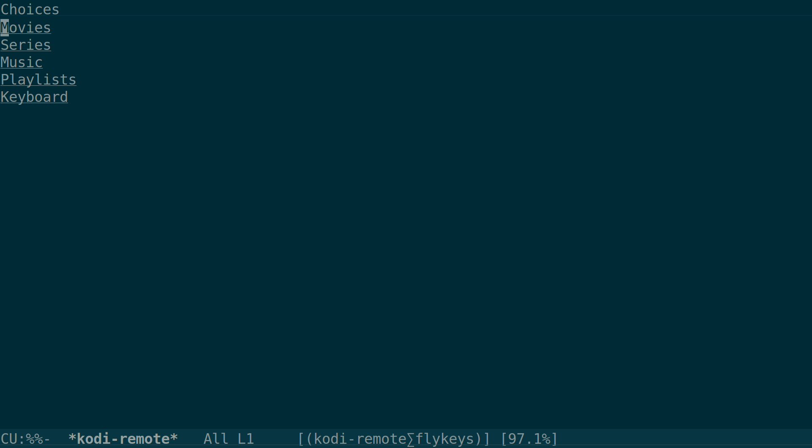

# kodi-remote

Emacs Remote Control for Kodi

## Requirements
for kodi-remote-play-video-url you need to install youtube-dl
* see youtube-dl for [supported sites](https://github.com/rg3/youtube-dl/blob/master/docs/supportedsites.md)

for kodi-remote-play-stream-url you need to have the youtube
plugin installed in kodi

## Installation
Available as the kodi-remote package on MELPA http://melpa.org/

Or manually:

	M-x package-install-file RET /path/to/kodi-remote.el RET

## Setup

### set the host name of the htpc instance:
    (setq kodi-host-name "my-htpc:8080")

### OPTIONAL:
	To use alternative playlist system (titles of youtube movies):
	(setq kodi-network-interface "enp0s25")
	For functionality that need direct write access to the filesystem:
	(setq kodi-dangerous-options t)
	(setq kodi-access-host "my-htpc")
	if you don't use ssh to access your kodi server / nas:
	(setq kodi-access-method "smb/ftp/adb...")

## Using

### open kodi remote:
    M-x kodi-remote

### start playback of a youtube video
    M-x kodi-remote-play-video-url RET <paste youtube url> RET

### alternatively:
    M-x kodi-remote-play-stream-url RET <paste youtube url> RET
	(advantage is that it works also with streamed videos)

### open the kodi playlist
    M-x kodi-remote-playlist RET

## Contributing

Yes, please do! See [CONTRIBUTING][] for guidelines.

## License

See [COPYING][]. Copyright (c) 2015 Stefan Huchler.

[CONTRIBUTING]: ./CONTRIBUTING.md
[COPYING]: ./COPYING
